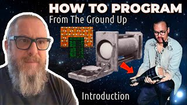
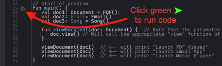

click for my explainer Video on YouTube:

Table of Contents of Examples:

- [00-Magic Numbers](./src/main/kotlin/00_MagicNumbers.kt)
- [01-Constants To Enums to Sealed Classes](./src/main/kotlin/01_ConstantToEnumToSealedClass.kt)
- [02-Many Parameters Become a Class](src/main/kotlin/02_ManyParamsBecomeAClass.kt)
- [03-Fix Deceptive Parameter Lists](src/main/kotlin/03_FixDeceptiveParameterLists.kt)
- [04-Return Parameters Become a Type](src/main/kotlin/04_ReturnParametersReplacedWithAType.kt)
- [05-Variables With Similar Names Become a Class](src/main/kotlin/05_VariablesWithSimilarNamesBecomeAClass.kt)
- [06-One hundred+ lines Become a Function](src/main/kotlin/06_OneHundredLinesToAFunction.kt)
- [07-Comments on Close Brackets](src/main/kotlin/07_CommentsOnCloseBrackets.kt)
- [08-Hide Complexity Within Classes](src/main/kotlin/08_HideComplexityWithinClasses.kt)
- [09-Implementation Inheritance](src/main/kotlin/09_ImplementationInheritance.kt)
- [10-Multiple Implementations For Each Type Vs Generics](src/main/kotlin/10_MultipleImplementationsForEachTypeVsGenerics.kt)
- [11-"Type Switches" Become Classes](src/main/kotlin/11_TypeSwitchesInsteadOfUsingClasses.kt)
- [12-Huge Interfaces Become Segregated Interfaces](src/main/kotlin/12_HugeInterfaceToSegregatedInterface.kt)

Based on this talk:

Check out my free course on YouTube: ["How to Program from the Ground Up"](https://www.youtube.com/playlist?list=PLzUxWOrVXB4QHsURai1GmmhmqAUVNbfno)

# How To Install and Run The Samples In This Guide
  - [Install IntelliJ IDEA Community Edition](https://www.jetbrains.com/idea/download/)
  - [How to clone this Project from Github to your local machine](https://www.jetbrains.com/guide/java/tips/clone-project-from-github/#:~:text=Clone%20a%20project%20from%20the%20IntelliJ%20IDEA%20welcome%20screen&text=Click%20Get%20from%20VCS%2C%20specify,into%20an%20IntelliJ%20IDEA%20project.)
  - Navigate to this `README.md` file in the project and click on the links to the live sample code.
  - In the left-hand gutter, click on the green arrow to run the sample code.
    
    
